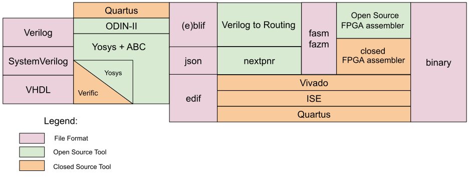

# FemtoRV - RISCV Processor on Artix 35T

RISC-V is a free and open ISA enabling a new era of processor innovation through open standard collaboration. Recently it has gained popularity with major players like Intel, Apple, and NASA implementing RISC-V solutions.

## Goals of the Project
 
I'm a final year student pursuing my undergraduate in Electronics and communication engineering at Manipal Institue of Technology.
Fascinated by Computer architecture and VLSI design, I came across RISC-V during the [Swadeshi microprocessor challenge.](https://shakti.org.in/sp2020-shakti.html) 

The goal of this project is:
- Implement the RISC32I ISA on a single-core processor with pipelining.
- Apply the knowledge of computer architecture design and Verilog
- Understand and explore the various toolchains and software required in ASIC and FPGA applications.
- Implement optimizations for reducing required LUTS and increasing the performance of the core.
- Use the developed core to implement a flight controller and interface with various sensors and actuators required.

The work in the repository wouldn't be possible without @BrunoLevy and his work at [BrunoLevy/learn-fpga](https://github.com/BrunoLevy/learn-fpga)
The project by him provides an excellent step-wise explanation of developing a RISC-V and serves as the base on which this project is created.

Based on his project, I have optimized it and implemented it on the ARTIX7 35T FPGA using the F4PGA toolchain.

## Setting up the Required Software

### F4PGA
*F4PGA is an end-to-end FPGA synthesis toolchain, because of that it provides all the necessary tools to convert input Hardware Description Language (HDL) sources into a final bitstream*

[https://f4pga.readthedocs.io/en/latest/getting-started.html](https://f4pga.readthedocs.io/en/latest/getting-started.html)

### Icarus Verilog
*Icarus Verilog is a Verilog simulation and synthesis tool. It operates as a compiler, compiling source code written in Verilog (IEEE-1364) into some target format. For batch simulation, the compiler can generate an intermediate form called vvp assembly*

[http://iverilog.icarus.com/](http://iverilog.icarus.com/)

### Verilatior
*Verilator is a free and open-source software tool which converts Verilog to a cycle-accurate behavioral model in C++ or SystemC.*

[https://www.veripool.org/verilator/](https://www.veripool.org/verilator/)

### Picocom
*picocom is a minimal dumb-terminal emulation program*

[https://linux.die.net/man/8/picocom](https://linux.die.net/man/8/picocom)

## File Description

    .
    ├── Verilator                  # Source files requried for Verilator simulation
    ├── Include                    # Header files
    ├── arty.xdc                   # Constraint file for Artix7 35T  
    ├── bench_iverilog.v           # Bench code for icarus verilog simulation        
    ├── femtoRV.v                  # main verilog file with core
    ├── run_verilator.sh           # Shell script to execute verilator simulation
    ├── sim_main.cpp               # Cpp code for verilator simulation
    ├── terminal.sh                # Shell script to open Serial terminal
    └── README.md

