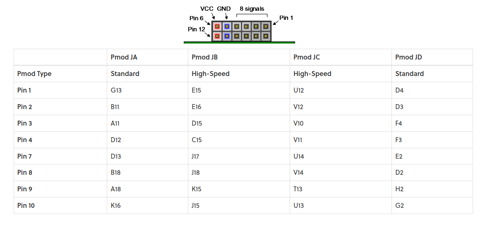
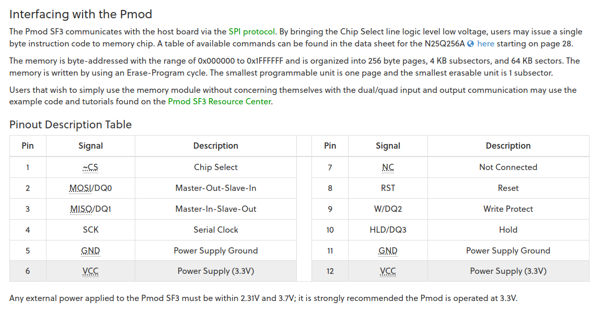
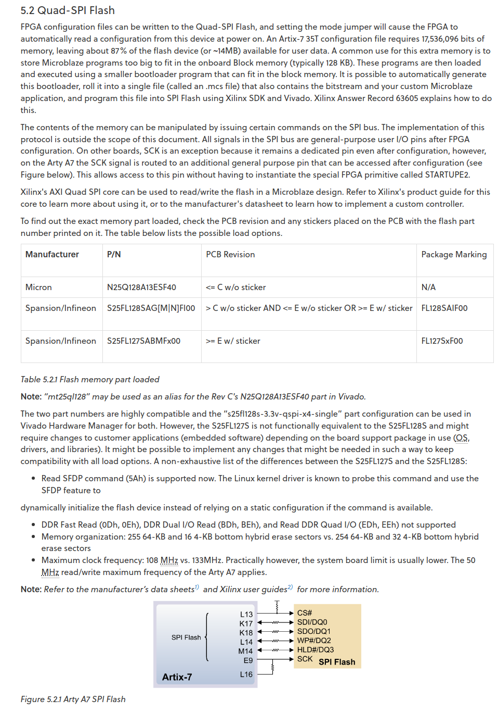

# Reference Doc to get the SPI working.

## PMOD Pinout 

## ARTY Reference 

[https://digilent.com/reference/programmable-logic/arty-a7/reference-manual](https://digilent.com/reference/programmable-logic/arty-a7/reference-manual)

[Onboard SPI Datasheet](https://www.infineon.com/dgdl/Infineon-S25FL128S_S25FL256S_128_Mb_(16_MB)_256_Mb_(32_MB)_3.0V_SPI_Flash_Memory-DataSheet-v18_00-EN.pdf?fileId=8ac78c8c7d0d8da4017d0ecfb6a64a17&utm_source=cypress&utm_medium=referral&utm_campaign=202110_globe_en_all_integration-files)

## PMOD SF3 Refernce

